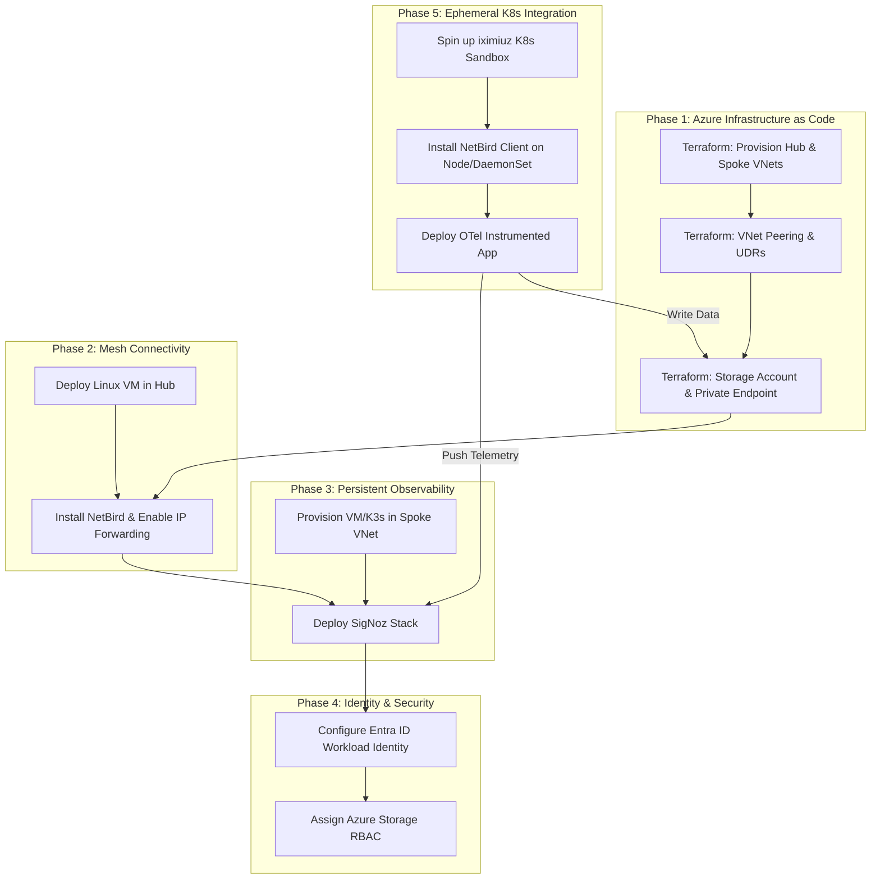

# azure-hybrid-observability

```mermaid
graph TD
    %% Implementation Phases
    subgraph Phase 1: Azure Infrastructure as Code
        A1[Terraform: Provision Hub & Spoke VNets] --> A2[Terraform: VNet Peering & UDRs]
        A2 --> A3[Terraform: Storage Account & Private Endpoint]
    end

    subgraph Phase 2: Mesh Connectivity
        B1[Deploy Linux VM in Hub] --> B2[Install NetBird & Enable IP Forwarding]
        A3 --> B2
    end

    subgraph Phase 3: Persistent Observability
        C1[Provision VM/K3s in Spoke VNet] --> C2[Deploy SigNoz Stack]
        B2 --> C2
    end

    subgraph Phase 4: Identity & Security
        D1[Configure Entra ID Workload Identity] --> D2[Assign Azure Storage RBAC]
        C2 --> D1
    end

    subgraph Phase 5: Ephemeral K8s Integration
        E1[Spin up iximiuz K8s Sandbox] --> E2[Install NetBird Client on Node/DaemonSet]
        E2 --> E3[Deploy OTel Instrumented App]
        E3 --> |Push Telemetry| C2
        E3 --> |Write Data| A3
    end
```